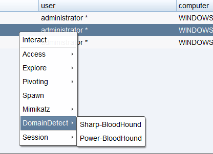

# Aggressor Scripts

[English](./README.md) | [中文简体](./README_zh.md)


| 类别 | 说明 |
| ---- | --- |
| Author | [Rvn0xsy](https://github.com/Rvn0xsy) | 
| Team | [0x727](https://github.com/0x727) Open source tools will continue for some time to come |
| Position | This project integrates multiple AggressorScripts and multiple PE files to form a CNA-only toolkit, which needs to be loaded on Cobalt Strike for browsing capabilities and rapid penetration.|
| Language | Aggressor Script、C++、C# |
| Function | Support red team penetration testing in multiple scenarios of Cobalt Strike | 


## What is Aggressor Scripts ?

[Aggressor Script](https://cobaltstrike.com/aggressor-script/index.html) is the scripting language built into Cobalt Strike, version 3.0, and later. Aggresor Script allows you to modify and extend the Cobalt Strike client.

## Why Aggressor Scripts ?

Aggressor Script is the scripting language built into Cobalt Strike, version 3.0, and later. Aggresor Script allows you to modify and extend the Cobalt Strike client.

## Quick start Installation

**Download Install**

Download [Release](https://github.com/0x727/AggressorScripts/releases) Zip File.

**Git Download**

```bash
$ git clone https://github.com/0x727/AggressorScripts
```

## Usage example


Please follow the [Cobalt Strike Aggressor Script](https://cobaltstrike.com/aggressor-script/index.html) documentation

> Users need to understand the basic concepts of Cobalt Strike Aggressor Script


## CHANGE LOG


**2020/01/08**

- Support Pass-The-Hash(PTH)
- Support DcSync
- Support Clone User
- Support Mimikatz logonPasswords
- Support Mimikatz Skeleton
- Support Dump krbtgt Hash
- Support Create Golden ticket
- Support Impersonate Process Token

**2020/01/08**

- Support [Frp](https://github.com/fatedier/frp) Config
- Support Dump Navicat Passwords
- Support Dump Browser Passwords

**2020/07/07**

- Support PrintSpool local privilege escalation
- Support [atexec](https://payloads.online/archivers/2020-06-28/1)
- Support SpwanReflectiveC2
- Support DingDing Robot (MacOS,Windows 10,Linux)
- Fix several Powershell script loading problems

**2020/07/10**

- Update the reflection DLL derived from Aliyun C2

> Since Cobaltstrike 4.0 has a problem with judging the number of processes, temporarily use the x86 test to pass

**20201/03/11**

- [Support DingDing robot reminder](./DingPack/DIngPack.cna)


### Mimikatz

- Support Pass-The-Hash(PTH)
- Support DcSync
- Support Clone User
- Support Mimikatz logonPasswords
- Support Mimikatz Skeleton
- Support Dump krbtgt Hash
- Support the creation of Golden ticket
- Support for listing access tokens, access token privilege elevation, and access token counterfeiting
- One-click execution Dump lsass.exe
- One-click execution Lazagne.exe
- One-click execution Dump Navicat Passwords
- One-click execution Bloodhund Powershell
- One-click execution Bloodhund C#


### Procdump && Lazagne && Navicat

- One-click execution Dump lsass.exe
- One-click execution [Lazagne](https://github.com/AlessandroZ/LaZagne)
- One-click execution Dump Navicat Passwords


**Lazagne.exe file bottleneck, need to wait**

### Bloodhound

- One-click execution [Bloodhound](https://github.com/BloodHoundAD/BloodHound) Powershell
- One-click execution Bloodhound C#




## Key technology

- [Cobalt Strike Aggressor Script （第一课）](https://payloads.online/archivers/2020-03-02/4)
- [Cobalt Strike Aggressor Script （第二课）](https://payloads.online/archivers/2020-03-02/5)
- [通过反射DLL注入来构建后渗透模块（第一课）](https://payloads.online/archivers/2020-03-02/1)
- [如何实现一个Atexec](https://payloads.online/archivers/2020-06-28/1)
- [如何实现一个Psexec](https://payloads.online/archivers/2020-04-02/1)


## Contributing

Interested in getting involved? We would like to help you!

* Take a look at our [issues list](https://github.com/0x727/AggressorScripts_0x727/issues) and consider sending a Pull Request to **dev branch**.
* If you want to add a new feature, please create an issue first to describe the new feature, as well as the implementation approach. Once a proposal is accepted, create an implementation of the new features and submit it as a pull request.
* Sorry for my poor English. Improvements for this document are welcome, even some typo fixes.
* If you have great ideas, email 0x727Team@gmail.com.

## Stargazers over time

[](https://github.com/0x727/AggressorScripts_0x727)


## Thanks for these open source projects

- [LaZagne](https://github.com/AlessandroZ/LaZagne)
- [Mimikatz](https://github.com/gentilkiwi/mimikatz)
- [Bloodhound](https://github.com/BloodHoundAD/BloodHound)
- [PowerSploit](https://github.com/PowerShellMafia/PowerSploit)
- [frp](https://github.com/fatedier/frp)
- [BrowserGhost](https://github.com/QAX-A-Team/BrowserGhost)
- [Ladon](https://github.com/k8gege/Ladon)
- ...