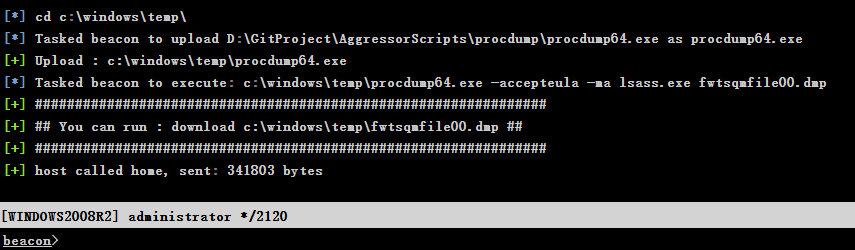
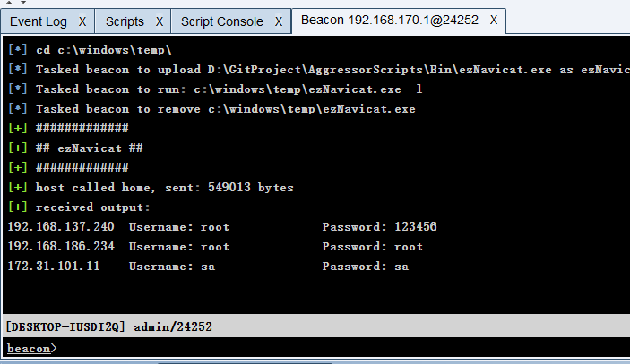

# Aggressor Scripts

[English](./index.md) | [中文简体](./README_zh.md)


| 类别 | 说明 |
| ---- | --- |
| 作者 | [Rvn0xsy](https://github.com/Rvn0xsy) | 
| 团队 | [0x727](https://github.com/0x727) 未来一段时间将陆续开源工具 |
| 定位 | 本项目集成多个 AggressorScripts 与多个PE文件形成一个CNA工具包，只需要加载到Cobalt Strike上即可享受便捷、快速的渗透之旅。|
| 语言 | Aggressor Script、C++、C# |
| 功能 | 支持Cobalt Strike多种场景下的红队渗透测试工作| 

## 什么是 Aggressor Scripts ?

在红队工作中，有许多需求需要在C2中实现，因此我根据Cobalt Strike的标准文档，集成了多种功能的Aggressor Scripts

## 为什么选择 Aggressor Scripts ?

在红队工作中，有很多需求需要在C2中实现，所以我集成了一个基于Cobalt Strike的标准文档的多功能Aggressor Scripts。

## 快速开始体验

**下载安装包**

下载 [Release](https://github.com/0x727/AggressorScripts_0x727/releases) 压缩包.

**Git下载安装**

```bash
$ git clone https://github.com/0x727/AggressorScripts_0x727
```

## 使用方法

请根据[Cobalt Strike Aggressor Script](https://cobaltstrike.com/aggressor-script/index.html) 文档进行操作

> 使用者需要了解Cobalt Strike Aggressor Script的基本概念


## 更新日志


**2020/01/08**

- 支持hash传递
- 支持DcSync
- 支持克隆管理员到guest用户
- 支持抓取密码
- 支持任意认证后门 - Mimikatz Skeleton
- 支持抓取krbtgt Hash
- 支持创建黄金票据
- 支持列出访问令牌、访问令牌权限提升、访问令牌假冒

**2020/01/08**

- 支持一键配置FRP代理
- 支持一键抓取Navicat管理软件密码
- 支持一键抓取浏览器保存密码

**2020/07/07**

- 支持PrintSpool打印机提权
- 支持 [atexec](https://payloads.online/archivers/2020-06-28/1) 横向移动
- 整合提权脚本代码至elevate.cna文件
- 支持SpwanReflectiveC2功能，通过SpawnC2能够直接派生域前置C2
- 钉钉机器人脚本重写，适配(MacOS,Windows 10,Linux)
- 修复若干Powershell脚本加载问题

**2020/07/10**

- 更新派生Aliyun C2的反射DLL
> 由于Cobaltstrike 4.0判断进程位数有点问题，暂时使用x86测试通过

**20201/03/11**

- [支持DingDing机器人提醒](./DingPack/DIngPack.cna)


### Mimikatz 系列

- 支持hash传递
- 支持DcSync
- 支持克隆管理员到guest用户
- 支持抓取密码
- 支持任意认证后门 - Mimikatz Skeleton
- 支持抓取krbtgt Hash
- 支持创建黄金票据
- 支持列出访问令牌、访问令牌权限提升、访问令牌假冒
- 一键转储lsass.exe内存
- 一键执行Lazagne.exe
- 一键读取Navicat密码
- 一键执行Bloodhound Powershell版本
- 一键执行Bloodhound C#版本


### Procdump && Lazagne && Navicat

- 一键转储lsass.exe内存
- 一键执行[Lazagne](https://github.com/AlessandroZ/LaZagne)
- 一键读取Navicat密码





**Lazagne文件太大，需要等待**

### Bloodhound

- 一键执行Powershell版本
- 一键执行C#版本


## 涉及知识点

- [Cobalt Strike Aggressor Script （第一课）](https://payloads.online/archivers/2020-03-02/4)
- [Cobalt Strike Aggressor Script （第二课）](https://payloads.online/archivers/2020-03-02/5)
- [通过反射DLL注入来构建后渗透模块（第一课）](https://payloads.online/archivers/2020-03-02/1)
- [如何实现一个Atexec](https://payloads.online/archivers/2020-06-28/1)
- [如何实现一个Psexec](https://payloads.online/archivers/2020-04-02/1)

## 为 Aggressor Script 做贡献

Aggressor Script 是一个免费且开源的项目，我们欢迎任何人为其开发和进步贡献力量。

- 在使用过程中出现任何问题，可以通过 issues 来反馈。
- Bug 的修复可以直接提交 Pull Request 到 dev 分支。
- 如果是增加新的功能特性，请先创建一个 [issue](https://github.com/0x727/AggressorScripts_0x727/issues) 并做简单描述以及大致的实现方法，提议被采纳后，就可以创建一个实现新特性的 Pull Request。
- 欢迎对说明文档做出改善，帮助更多的人使用 Aggressor Script，特别是英文文档。
- 贡献代码请提交 PR 至 dev 分支，master 分支仅用于发布稳定可用版本。
- 如果你有任何其他方面的问题或合作，欢迎发送邮件至 0x727Team@gmail.com 。

> 提醒：和项目相关的问题最好在 issues 中反馈，这样方便其他有类似问题的人可以快速查找解决方法，并且也避免了我们重复回答一些问题。

## Stargazers over time

[](https://github.com/0x727/AggressorScripts_0x727)

## 感谢这些开源项目

- [LaZagne](https://github.com/AlessandroZ/LaZagne)
- [Mimikatz](https://github.com/gentilkiwi/mimikatz)
- [Bloodhound](https://github.com/BloodHoundAD/BloodHound)
- [PowerSploit](https://github.com/PowerShellMafia/PowerSploit)
- [frp](https://github.com/fatedier/frp)
- [BrowserGhost](https://github.com/QAX-A-Team/BrowserGhost)
- [Ladon](https://github.com/k8gege/Ladon)
- ...
